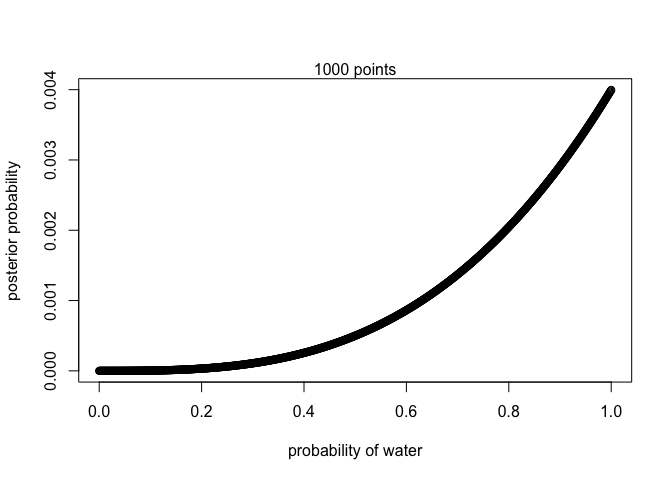

```r
#WWL

p_grid <- seq( from=0 , to=1 , length.out=1000)

prior <- rep( 1 , 1000 )

likelihood <- dbinom( 3 , size=3 , prob=p_grid )

unstd.posterior <- likelihood * prior

posterior <- unstd.posterior / sum(unstd.posterior)
sum(posterior)
```

```
## [1] 1
```

```r
plot( p_grid , posterior , type="b" ,
xlab="probability of water" , ylab="posterior probability" )
mtext( "1000 points" )
```

<!-- -->

```r
#WWWL

p_grid <- seq( from=0 , to=1 , length.out=1000)

prior <- rep( 1 , 1000 )

likelihood <- dbinom( 3 , size=4 , prob=p_grid )

unstd.posterior <- likelihood * prior

posterior <- unstd.posterior / sum(unstd.posterior)
sum(posterior)
```

```
## [1] 1
```

```r
plot( p_grid , posterior , type="b" ,
xlab="probability of water" , ylab="posterior probability" )
mtext( "1000 points" )
```

<!-- -->


```r
#LWWLWWW

p_grid <- seq( from=0 , to=1 , length.out=1000)

prior <- rep( 1 , 1000 )

likelihood <- dbinom( 5 , size=7 , prob=p_grid )

unstd.posterior <- likelihood * prior

posterior <- unstd.posterior / sum(unstd.posterior)
sum(posterior)
```

```
## [1] 1
```

```r
plot( p_grid , posterior , type="b" ,
xlab="probability of water" , ylab="posterior probability" )
mtext( "1000 points" )
```

<!-- -->

```r
#WWL

p_grid <- seq( from=0 , to=1 , length.out=1000)

prior <- ifelse(p_grid < .5, 0, 1)

likelihood <- dbinom( 3 , size=3 , prob=p_grid )

unstd.posterior <- likelihood * prior

posterior <- unstd.posterior / sum(unstd.posterior)
sum(posterior)
```

```
## [1] 1
```

```r
plot( p_grid , posterior , type="b" ,
xlab="probability of water" , ylab="posterior probability" )
mtext( "1000 points" )
```

<!-- -->

```r
plot_posterior <- function(x, y) {
  plot(x = x, y = y, type="b", xlab = "Probability of Water", ylab = "Posterior Probability")
  title <- paste( length(x), "Points")
  mtext(title)
}

#WWL
data1 <- c('W','W','W','L')
# total number of tosses
n = length(data1) 
# observed number of water
w = sum(data1=='W')  

# define grid
p_grid <- seq( from=0 , to=1 , length.out=100)
length_of_grid = length(p_grid)

# prior probability of p
prior <- ifelse( p_grid < 0.5 , 0 , 1 ) 

# compute likelihood at each value in grid
likelihood <- dbinom( w , size=n , prob=p_grid )

# compute product of likelihood and prior
unstd.posterior <- likelihood * prior

# standardize the posterior, so it sums to 1
posterior <- unstd.posterior / sum(unstd.posterior)

plot_posterior(x = p_grid, y = posterior)
```

<!-- -->


```r
data1 <- c('L', 'W', 'W', 'L', 'W', 'W', 'W')
# total number of tosses
n = length(data1)
# observed number of water
w = sum(data1=='W') 

# define grid
p_grid <- seq( from=0 , to=1 , length.out=100)
length_of_grid = length(p_grid)

# prior probability of p
prior <- ifelse( p_grid < 0.5 , 0 , 1 )  

# compute likelihood at each value in grid
likelihood <- dbinom( w , size=n , prob=p_grid )

# compute product of likelihood and prior
unstd.posterior <- likelihood * prior

# standardize the posterior, so it sums to 1
posterior <- unstd.posterior / sum(unstd.posterior)

plot_posterior(x = p_grid, y = posterior)
```

<!-- -->
