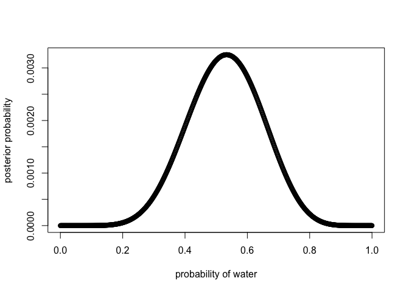

###Chapter 3 - Trying the Code


```r
p_grid <- seq( from=0 , to=1 , length.out=1000 )
prob_p <- rep( 1 , 1000 )
prob_data <- dbinom( 6 , size=9 , prob=p_grid )
posterior <- prob_data * prob_p
posterior <- posterior / sum(posterior)
samples <- sample( p_grid , prob=posterior , size=1e4 , replace=TRUE )
plot( samples )
```

<!-- -->

```r
library(rethinking)
```

```
## Loading required package: rstan
```

```
## Loading required package: ggplot2
```

```
## Loading required package: StanHeaders
```

```
## rstan (Version 2.18.2, GitRev: 2e1f913d3ca3)
```

```
## For execution on a local, multicore CPU with excess RAM we recommend calling
## options(mc.cores = parallel::detectCores()).
## To avoid recompilation of unchanged Stan programs, we recommend calling
## rstan_options(auto_write = TRUE)
```

```
## Loading required package: parallel
```

```
## rethinking (Version 1.88)
```

```r
dens( samples )
```

<!-- -->
###Chapter 3 HW Questions
####3E1 - 3E7

```r
p_grid <- seq( from=0 , to=1 , length.out=1000 )
prior <- rep( 1 , 1000 )
likelihood <- dbinom( 6 , size=9 , prob=p_grid )
posterior <- likelihood * prior
posterior <- posterior / sum(posterior)
set.seed(100)
samples <- sample( p_grid , prob=posterior , size=1e4 , replace=TRUE )
```

#####3E1. How much posterior probability lies below p = 0.2?

```r
sum( samples < 0.2)/10000
```

```
## [1] 5e-04
```
#####3E2. How much posterior probability lies above p = 0.8?

```r
sum( samples < 0.8)/10000
```

```
## [1] 0.8883
```
#####3E3. How much posterior probability lies between p = 0.2 and p = 0.8?

```r
sum( samples > 0.2 & samples < 0.8 ) / 10000
```

```
## [1] 0.8878
```
#####3E4. 20% of the posterior probability lies below which value of p?

```r
quantile( samples , 0.2 )
```

```
##       20% 
## 0.5195195
```
#####3E5. 20% of the posterior probability lies above which value of p?

```r
PI( samples , prob=0.2 )
```

```
##       40%       60% 
## 0.6066066 0.6786787
```
#####3E6. Which values of p contain the narrowest interval equal to 66% of the posterior probability?

```r
HPDI( samples , prob=0.66 )
```

```
##     |0.66     0.66| 
## 0.5205205 0.7847848
```
#####3E7. Which values of p contain 66% of the posterior probability, assuming equal posterior probability both below and above the interval?

```r
PI( samples , prob=0.66 )
```

```
##       17%       83% 
## 0.5005005 0.7687688
```
####3M1 - 3M4
#####3M1. Suppose the globe tossing data had turned out to be 8 water in 15 tosses. Construct the posterior distribution, using grid approximation. Use the same flat prior as before.

```r
p_grid <- seq( from=0 , to=1 , length.out=1000 )
prior <- rep(1,1000)
likelihood <- dbinom( 8 , size=15 , prob=p_grid )
posterior <- likelihood * prior
posterior <- posterior / sum(posterior)
plot( p_grid , posterior , type="b" , xlab="probability of water" , ylab="posterior probability" )
```

<!-- -->
#####3M2. Draw 10,000 samples from the grid approximation from above. Then use the samples to calculate the 90% HPDI for p.

```r
p_grid <- seq( from=0 , to=1 , length.out=1000 )
prior <- rep(1,1000)
likelihood <- dbinom( 8 , size=15 , prob=p_grid )
posterior <- likelihood * prior
posterior <- posterior / sum(posterior)
samples <- sample( p_grid , prob=posterior , size=1e4 , replace=TRUE )
HPDI(samples, prob = .9)
```

```
##      |0.9      0.9| 
## 0.3383383 0.7317317
```
#####3M3. Construct a posterior predictive check for this model and data. This means simulate the distribution of samples, averaging over the posterior uncertainty in p. What is the probability of observing 8 water in 15 tosses?

```r
w <- rbinom(1e4 , size= 15, prob=samples)
sum(w == 8) / 1e4
```

```
## [1] 0.1428
```
#####3M4. Using the posterior distribution constructed from the new (8/15) data, now calculate the probability of observing 6 water in 9 tosses.

```r
w <- rbinom(1e4 , size= 9, prob=samples)
sum(w == 6) / 1e4
```

```
## [1] 0.1695
```
