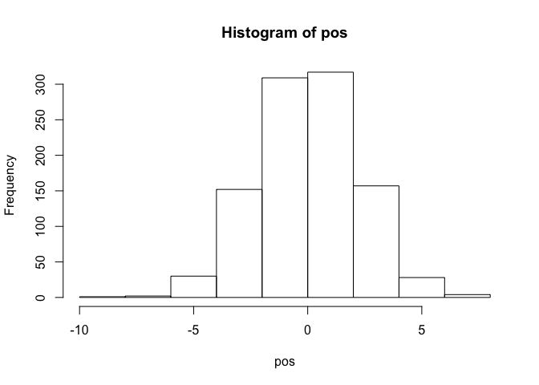
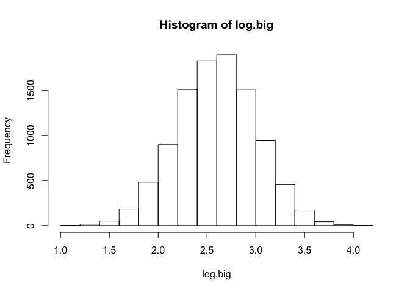
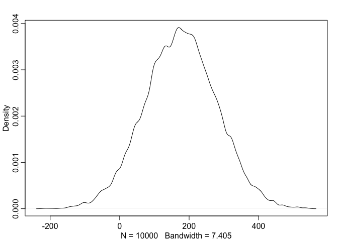
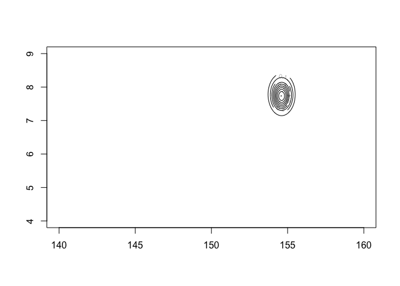
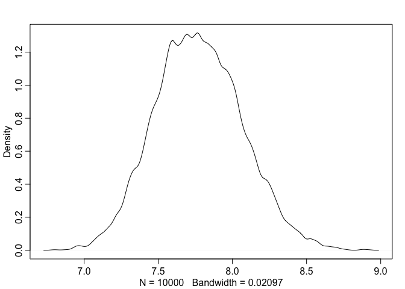
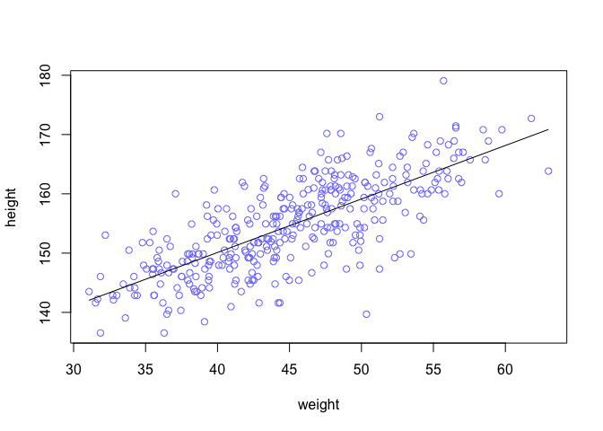
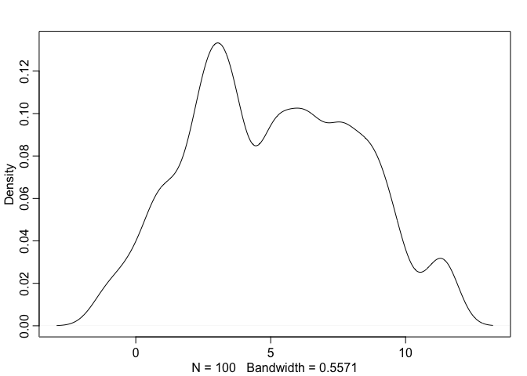

```r
pos <- replicate( 1000 , sum( runif(16,-1,1) ) )
hist(pos)
```

<!-- -->

```r
plot(density(pos))
```

<!-- -->


```r
library(rethinking)
```

```
## Loading required package: rstan
```

```
## Loading required package: ggplot2
```

```
## Loading required package: StanHeaders
```

```
## rstan (Version 2.18.2, GitRev: 2e1f913d3ca3)
```

```
## For execution on a local, multicore CPU with excess RAM we recommend calling
## options(mc.cores = parallel::detectCores()).
## To avoid recompilation of unchanged Stan programs, we recommend calling
## rstan_options(auto_write = TRUE)
```

```
## Loading required package: parallel
```

```
## rethinking (Version 1.88)
```

```r
prod( 1 + runif(12,0,0.1) )
```

```
## [1] 1.668455
```

```r
growth <- replicate( 10000 , prod( 1 + runif(12,0,0.1) ) )
dens( growth , norm.comp=TRUE )
```

<!-- -->


```r
big <- replicate( 10000 , prod( 1 + runif(12,0,0.5) ) )
small <- replicate( 10000 , prod( 1 + runif(12,0,0.01) ) )
log.big <- replicate( 10000 , log(prod(1 + runif(12,0,0.5))) )
hist(small)
```

<!-- -->

```r
hist(big)
```

<!-- -->

```r
hist(log.big)
```

<!-- -->


```r
library(rethinking)
data(Howell1)
d <- Howell1
str( d )
```

```
## 'data.frame':	544 obs. of  4 variables:
##  $ height: num  152 140 137 157 145 ...
##  $ weight: num  47.8 36.5 31.9 53 41.3 ...
##  $ age   : num  63 63 65 41 51 35 32 27 19 54 ...
##  $ male  : int  1 0 0 1 0 1 0 1 0 1 ...
```

```r
precis( d )
```

```
##               mean         sd      5.5%     94.5%     histogram
## height 138.2635963 27.6024476 81.108550 165.73500 ▁▁▁▁▁▁▁▂▁▇▇▅▁
## weight  35.6106176 14.7191782  9.360721  54.50289 ▁▂▃▂▂▂▂▅▇▇▃▂▁
## age     29.3443934 20.7468882  1.000000  66.13500     ▇▅▅▃▅▂▂▁▁
## male     0.4724265  0.4996986  0.000000   1.00000    ▇▁▁▁▁▁▁▁▁▇
```

```r
d$height
```

```
##   [1] 151.7650 139.7000 136.5250 156.8450 145.4150 163.8300 149.2250
##   [8] 168.9100 147.9550 165.1000 154.3050 151.1300 144.7800 149.9000
##  [15] 150.4950 163.1950 157.4800 143.9418 121.9200 105.4100  86.3600
##  [22] 161.2900 156.2100 129.5400 109.2200 146.4000 148.5900 147.3200
##  [29] 137.1600 125.7300 114.3000 147.9550 161.9250 146.0500 146.0500
##  [36] 152.7048 142.8750 142.8750 147.9550 160.6550 151.7650 162.8648
##  [43] 171.4500 147.3200 147.9550 144.7800 121.9200 128.9050  97.7900
##  [50] 154.3050 143.5100 146.7000 157.4800 127.0000 110.4900  97.7900
##  [57] 165.7350 152.4000 141.6050 158.8000 155.5750 164.4650 151.7650
##  [64] 161.2900 154.3050 145.4150 145.4150 152.4000 163.8300 144.1450
##  [71] 129.5400 129.5400 153.6700 142.8750 146.0500 167.0050 158.4198
##  [78]  91.4400 165.7350 149.8600 147.9550 137.7950 154.9400 160.9598
##  [85] 161.9250 147.9550 113.6650 159.3850 148.5900 136.5250 158.1150
##  [92] 144.7800 156.8450 179.0700 118.7450 170.1800 146.0500 147.3200
##  [99] 113.0300 162.5600 133.9850 152.4000 160.0200 149.8600 142.8750
## [106] 167.0050 159.3850 154.9400 148.5900 111.1250 111.7600 162.5600
## [113] 152.4000 124.4600 111.7600  86.3600 170.1800 146.0500 159.3850
## [120] 151.1300 160.6550 169.5450 158.7500  74.2950 149.8600 153.0350
## [127]  96.5200 161.9250 162.5600 149.2250 116.8400 100.0760 163.1950
## [134] 161.9250 145.4150 163.1950 151.1300 150.4950 141.6050 170.8150
## [141]  91.4400 157.4800 152.4000 149.2250 129.5400 147.3200 145.4150
## [148] 121.9200 113.6650 157.4800 154.3050 120.6500 115.6000 167.0050
## [155] 142.8750 152.4000  96.5200 160.0000 159.3850 149.8600 160.6550
## [162] 160.6550 149.2250 125.0950 140.9700 154.9400 141.6050 160.0200
## [169] 150.1648 155.5750 103.5050  94.6150 156.2100 153.0350 167.0050
## [176] 149.8600 147.9550 159.3850 161.9250 155.5750 159.3850 146.6850
## [183] 172.7200 166.3700 141.6050 142.8750 133.3500 127.6350 119.3800
## [190] 151.7650 156.8450 148.5900 157.4800 149.8600 147.9550 102.2350
## [197] 153.0350 160.6550 149.2250 114.3000 100.9650 138.4300  91.4400
## [204] 162.5600 149.2250 158.7500 149.8600 158.1150 156.2100 148.5900
## [211] 143.5100 154.3050 131.4450 157.4800 157.4800 154.3050 107.9500
## [218] 168.2750 145.4150 147.9550 100.9650 113.0300 149.2250 154.9400
## [225] 162.5600 156.8450 123.1900 161.0106 144.7800 143.5100 149.2250
## [232] 110.4900 149.8600 165.7350 144.1450 157.4800 154.3050 163.8300
## [239] 156.2100 153.6700 134.6200 144.1450 114.3000 162.5600 146.0500
## [246] 120.6500 154.9400 144.7800 106.6800 146.6850 152.4000 163.8300
## [253] 165.7350 156.2100 152.4000 140.3350 158.1150 163.1950 151.1300
## [260] 171.1198 149.8600 163.8300 141.6050  93.9800 149.2250 105.4100
## [267] 146.0500 161.2900 162.5600 145.4150 145.4150 170.8150 127.0000
## [274] 159.3850 159.4000 153.6700 160.0200 150.4950 149.2250 127.0000
## [281] 142.8750 142.1130 147.3200 162.5600 164.4650 160.0200 153.6700
## [288] 167.0050 151.1300 147.9550 125.3998 111.1250 153.0350 139.0650
## [295] 152.4000 154.9400 147.9550 143.5100 117.9830 144.1450  92.7100
## [302] 147.9550 155.5750 150.4950 155.5750 154.3050 130.6068 101.6000
## [309] 157.4800 168.9100 150.4950 111.7600 160.0200 167.6400 144.1450
## [316] 145.4150 160.0200 147.3200 164.4650 153.0350 149.2250 160.0200
## [323] 149.2250  85.0900  84.4550  59.6138  92.7100 111.1250  90.8050
## [330] 153.6700  99.6950  62.4840  81.9150  96.5200  80.0100 150.4950
## [337] 151.7650 140.6398  88.2650 158.1150 149.2250 151.7650 154.9400
## [344] 123.8250 104.1400 161.2900 148.5900  97.1550  93.3450 160.6550
## [351] 157.4800 167.0050 157.4800  91.4400  60.4520 137.1600 152.4000
## [358] 152.4000  81.2800 109.2200  71.1200  89.2048  67.3100  85.0900
## [365]  69.8500 161.9250 152.4000  88.9000  90.1700  71.7550  83.8200
## [372] 159.3850 142.2400 142.2400 168.9100 123.1900  74.9300  74.2950
## [379]  90.8050 160.0200  67.9450 135.8900 158.1150  85.0900  93.3450
## [386] 152.4000 155.5750 154.3050 156.8450 120.0150 114.3000  83.8200
## [393] 156.2100 137.1600 114.3000  93.9800 168.2750 147.9550 139.7000
## [400] 157.4800  76.2000  66.0400 160.7000 114.3000 146.0500 161.2900
## [407]  69.8500 133.9850  67.9450 150.4950 163.1950 148.5900 148.5900
## [414] 161.9250 153.6700  68.5800 151.1300 163.8300 153.0350 151.7650
## [421] 132.0800 156.2100 140.3350 158.7500 142.8750  84.4550 151.9428
## [428] 161.2900 127.9906 160.9852 144.7800 132.0800 117.9830 160.0200
## [435] 154.9400 160.9852 165.9890 157.9880 154.9400  97.9932  64.1350
## [442] 160.6550 147.3200 146.7000 147.3200 172.9994 158.1150 147.3200
## [449] 124.9934 106.0450 165.9890 149.8600  76.2000 161.9250 140.0048
## [456]  66.6750  62.8650 163.8300 147.9550 160.0200 154.9400 152.4000
## [463]  62.2300 146.0500 151.9936 157.4800  55.8800  60.9600 151.7650
## [470] 144.7800 118.1100  78.1050 160.6550 151.1300 121.9200  92.7100
## [477] 153.6700 147.3200 139.7000 157.4800  91.4400 154.9400 143.5100
## [484]  83.1850 158.1150 147.3200 123.8250  88.9000 160.0200 137.1600
## [491] 165.1000 154.9400 111.1250 153.6700 145.4150 141.6050 144.7800
## [498] 163.8300 161.2900 154.9000 161.3000 170.1800 149.8600 123.8250
## [505]  85.0900 160.6550 154.9400 106.0450 126.3650 166.3700 148.2852
## [512] 124.4600  89.5350 101.6000 151.7650 148.5900 153.6700  53.9750
## [519] 146.6850  56.5150 100.9650 121.9200  81.5848 154.9400 156.2100
## [526] 132.7150 125.0950 101.6000 160.6550 146.0500 132.7150  87.6300
## [533] 156.2100 152.4000 162.5600 114.9350  67.9450 142.8750  76.8350
## [540] 145.4150 162.5600 156.2100  71.1200 158.7500
```

```r
d2 <- d[ d$age >= 18 , ]
```


```r
dens(d2$height)
```

<!-- -->


```r
curve( dnorm( x , 178 , 20 ) , from=100 , to=250 )
```

<!-- -->

```r
curve( dunif( x , 0 , 50 ) , from=-10 , to=60 )
```

<!-- -->


```r
sample_mu <- rnorm( 1e4 , 178 , 20 )
sample_sigma <- runif( 1e4 , 0 , 50 )
prior_h <- rnorm( 1e4 , sample_mu , sample_sigma )
dens( prior_h )
```

<!-- -->


```r
sample_mu <- rnorm( 1e4 , 178 , 100 )
prior_h <- rnorm( 1e4 , sample_mu , sample_sigma )
dens( prior_h )
```

<!-- -->


```r
mu.list <- seq( from=140, to=160 , length.out=200 )
sigma.list <- seq( from=4 , to=9 , length.out=200 )
post <- expand.grid( mu=mu.list , sigma=sigma.list )
post$LL <- sapply( 1:nrow(post) , function(i) sum( dnorm(
d2$height ,
mean=post$mu[i] ,
sd=post$sigma[i] ,
log=TRUE ) ) )
post$prod <- post$LL + dnorm( post$mu , 178 , 20 , TRUE ) +
dunif( post$sigma , 0 , 50 , TRUE )
post$prob <- exp( post$prod - max(post$prod) )
```


```r
contour_xyz( post$mu , post$sigma , post$prob )
```

<!-- -->

```r
image_xyz( post$mu , post$sigma , post$prob )
```

<!-- -->


```r
sample.rows <- sample( 1:nrow(post) , size=1e4 , replace=TRUE ,
prob=post$prob )
sample.mu <- post$mu[ sample.rows ]
sample.sigma <- post$sigma[ sample.rows ]
plot( sample.mu , sample.sigma , cex=0.5 , pch=16 , col=col.alpha(rangi2,0.1) )
```

<!-- -->


```r
dens( sample.mu )
```

<!-- -->

```r
dens( sample.sigma )
```

<!-- -->

```r
HPDI( sample.mu )
```

```
##    |0.89    0.89| 
## 153.8693 155.1759
```

```r
HPDI( sample.sigma )
```

```
##    |0.89    0.89| 
## 7.266332 8.195980
```


```r
d3 <- sample( d2$height , size=20 )
mu.list <- seq( from=150, to=170 , length.out=200 )
sigma.list <- seq( from=4 , to=20 , length.out=200 )
post2 <- expand.grid( mu=mu.list , sigma=sigma.list )
post2$LL <- sapply( 1:nrow(post2) , function(i)
sum( dnorm( d3 , mean=post2$mu[i] , sd=post2$sigma[i] ,
log=TRUE ) ) )
post2$prod <- post2$LL + dnorm( post2$mu , 178 , 20 , TRUE ) +
dunif( post2$sigma , 0 , 50 , TRUE )
post2$prob <- exp( post2$prod - max(post2$prod) )
sample2.rows <- sample( 1:nrow(post2) , size=1e4 , replace=TRUE ,
prob=post2$prob )
sample2.mu <- post2$mu[ sample2.rows ]
sample2.sigma <- post2$sigma[ sample2.rows ]
plot( sample2.mu , sample2.sigma , cex=0.5 ,
col=col.alpha(rangi2,0.1) ,
xlab="mu" , ylab="sigma" , pch=16 )
```

<!-- -->


```r
dens( sample2.sigma , norm.comp=TRUE )
```

<!-- -->


```r
library(rethinking)
data(Howell1)
d <- Howell1
d2 <- d[ d$age >= 18 , ]
flist <- alist(
height ~ dnorm( mu , sigma ) ,
mu ~ dnorm( 178 , 20 ) ,
sigma ~ dunif( 0 , 50 )
)
m4.1 <- quap( flist , data=d2 )
precis( m4.1 )
```

```
##             mean        sd       5.5%      94.5%
## mu    154.607023 0.4119947 153.948576 155.265471
## sigma   7.731333 0.2913860   7.265642   8.197024
```


```r
m4.2 <- quap(
alist(
height ~ dnorm( mu , sigma ) ,
mu ~ dnorm( 178 , 0.1 ) ,
sigma ~ dunif( 0 , 50 )
) , data=d2 )
precis( m4.2 )
```

```
##            mean        sd      5.5%     94.5%
## mu    177.86375 0.1002354 177.70356 178.02395
## sigma  24.51753 0.9289198  23.03293  26.00212
```

```r
vcov( m4.1 )
```

```
##                 mu        sigma
## mu    0.1697396043 0.0002180295
## sigma 0.0002180295 0.0849058158
```

```r
diag( vcov( m4.1 ) )
```

```
##         mu      sigma 
## 0.16973960 0.08490582
```

```r
cov2cor( vcov( m4.1 ) )
```

```
##                mu       sigma
## mu    1.000000000 0.001816163
## sigma 0.001816163 1.000000000
```


```r
library(rethinking)
post <- extract.samples( m4.1 , n=1e4 )
head(post)
```

```
##         mu    sigma
## 1 154.4895 7.791326
## 2 154.2471 7.709976
## 3 154.7011 8.202501
## 4 155.1317 7.746380
## 5 154.2736 6.887481
## 6 154.5398 7.706207
```

```r
precis(post)
```

```
##             mean        sd       5.5%      94.5%     histogram
## mu    154.612078 0.4070083 153.958005 155.266490       ▁▁▅▇▂▁▁
## sigma   7.729875 0.2938965   7.261178   8.202838 ▁▁▁▁▂▅▇▇▃▁▁▁▁
```


```r
plot( d2$height ~ d2$weight )
```

<!-- -->


```r
set.seed(2971)
N <- 100 # 100 lines
a <- rnorm( N , 178 , 20 )
b <- rnorm( N , 0 , 10 )
plot( NULL , xlim=range(d2$weight) , ylim=c(-100,400) ,
xlab="weight" , ylab="height" )
abline( h=0 , lty=2 )
abline( h=272 , lty=1 , lwd=0.5 )
mtext( "b ~ dnorm(0,10)" )
xbar <- mean(d2$weight)
for ( i in 1:N ) curve( a[i] + b[i]*(x - xbar) ,
from=min(d2$weight) , to=max(d2$weight) , add=TRUE ,
col=col.alpha("black",0.2) )
```

<!-- -->

```r
b <- rlnorm( 1e4 , 0 , 1 )
dens( b , xlim=c(0,5) , adj=0.1 )
```

<!-- -->

```r
set.seed(2971)
N <- 100 # 100 lines
a <- rnorm( N , 178 , 20 )
b <- rlnorm( N , 0 , 1 )
```


```r
# load data again, since it's a long way back
library(rethinking)
data(Howell1)
d <- Howell1
d2 <- d[ d$age >= 18 , ]
# define the average weight, x-bar
xbar <- mean(d2$weight)
# fit model
m4.3 <- quap(
alist(
height ~ dnorm( mu , sigma ) ,
mu <- a + b*( weight - xbar ) ,
a ~ dnorm( 178 , 20 ) ,
b ~ dlnorm( 0 , 1 ) ,
sigma ~ dunif( 0 , 50 )
) ,
data=d2 )
precis( m4.3 )
```

```
##              mean         sd        5.5%       94.5%
## a     154.6013671 0.27030766 154.1693633 155.0333710
## b       0.9032807 0.04192363   0.8362787   0.9702828
## sigma   5.0718809 0.19115478   4.7663786   5.3773831
```

```r
round( vcov( m4.3 ) , 3 )
```

```
##           a     b sigma
## a     0.073 0.000 0.000
## b     0.000 0.002 0.000
## sigma 0.000 0.000 0.037
```


```r
plot( height ~ weight , data=d2 , col=rangi2 )
post <- extract.samples( m4.3 )
a_map <- mean(post$a)
b_map <- mean(post$b)
curve( a_map + b_map*(x - xbar) , add=TRUE )
```

<!-- -->


```r
post <- extract.samples( m4.3 )
post[1:5,]
```

```
##          a         b    sigma
## 1 154.8222 0.9409296 5.321281
## 2 154.3102 0.8870755 5.048150
## 3 154.5402 0.9617326 5.034705
## 4 154.6272 0.7871800 5.519274
## 5 154.8913 0.9240356 4.793029
```


```r
N <- 10
dN <- d2[ 1:N , ]
mN <- quap(
alist(
height ~ dnorm( mu , sigma ) ,
mu <- a + b*( weight - mean(weight) ) ,
a ~ dnorm( 178 , 20 ) ,
b ~ dlnorm( 0 , 1 ) ,
sigma ~ dunif( 0 , 50 )
) , data=dN )
#check uncertainty
# extract 20 samples from the posterior
post <- extract.samples( mN , n=20 )
# display raw data and sample size
plot( dN$weight , dN$height ,
xlim=range(d2$weight) , ylim=range(d2$height) ,
col=rangi2 , xlab="weight" , ylab="height" )
mtext(concat("N = ",N))
# plot the lines, with transparency
for ( i in 1:20 )
curve( post$a[i] + post$b[i]*(x-mean(dN$weight)) ,col=col.alpha("black",0.3) , add=TRUE )
```

<!-- -->


```r
post <- extract.samples( m4.3 )
mu_at_50 <- post$a + post$b * ( 50 - xbar )
dens( mu_at_50 , col=rangi2 , lwd=2 , xlab="mu|weight=50" )
```

<!-- -->

```r
HPDI( mu_at_50 , prob=0.89 )
```

```
##    |0.89    0.89| 
## 158.5894 159.6730
```


```r
mu <- link( m4.3 )
str(mu)
```

```
##  num [1:1000, 1:352] 157 157 157 157 158 ...
```

```r
# define sequence of weights to compute predictions for
# these values will be on the horizontal axis
weight.seq <- seq( from=25 , to=70 , by=1 )
# use link to compute mu
# for each sample from posterior
# and for each weight in weight.seq
mu <- link( m4.3 , data=data.frame(weight=weight.seq) )
str(mu)
```

```
##  num [1:1000, 1:46] 136 138 136 137 137 ...
```

```r
# use type="n" to hide raw data
plot( height ~ weight , d2 , type="n" )
# loop over samples and plot each mu value
for ( i in 1:100 )
points( weight.seq , mu[i,] , pch=16 , col=col.alpha(rangi2,0.1) )
```

<!-- -->

```r
# summarize the distribution of mu
mu.mean <- apply( mu , 2 , mean )
mu.HPDI <- apply( mu , 2 , HPDI , prob=0.89 )
# plot raw data
# fading out points to make line and interval more visible
plot( height ~ weight , data=d2 , col=col.alpha(rangi2,0.5) )
# plot the MAP line, aka the mean mu for each weight
lines( weight.seq , mu.mean )
# plot a shaded region for 89% HPDI
shade( mu.HPDI , weight.seq )
```

<!-- -->


```r
post <- extract.samples(m4.3)
mu.link <- function(weight) post$a + post$b*( weight - xbar )
weight.seq <- seq( from=25 , to=70 , by=1 )
mu <- sapply( weight.seq , mu.link )
mu.mean <- apply( mu , 2 , mean )
mu.HPDI <- apply( mu , 2 , HPDI , prob=0.89 )
```


```r
sim.height <- sim( m4.3 , data=list(weight=weight.seq) )
str(sim.height)
```

```
##  num [1:1000, 1:46] 144 139 140 136 139 ...
```

```r
height.PI <- apply( sim.height , 2 , PI , prob=0.89 )
# plot raw data
plot( height ~ weight , d2 , col=col.alpha(rangi2,0.5) )
# draw MAP line
lines( weight.seq , mu.mean )
# draw HPDI region for line
shade( mu.HPDI , weight.seq )
# draw PI region for simulated heights
shade( height.PI , weight.seq )
```

<!-- -->


```r
sim.height <- sim( m4.3 , data=list(weight=weight.seq) , n=1e4 )
height.PI <- apply( sim.height , 2 , PI , prob=0.89 )
```

####4M1

```r
sample_mu <- rnorm(1e2,0,10)
sample_sigma <- runif(1e2,0,10)
prior_y <- rnorm(sample_mu,sample_sigma)
dens(prior_y)
```

<!-- -->
####4M2


```r
flist <- alist(
y ~ dnorm( mu , sigma ),
mu <- a + b*x,
a ~ dnorm( 0 , 10 ),
b ~ dunif( 0 , 10 )
)
```
####4M3

```r
flist <- alist(
y ~ dnorm( mu , sigma ),
mu <- a + b*x,
a ~ dnorm( 0 , 50 ),
b ~ dunif( 0 , 10 ),
sigma ~ dunif( 0 , 50 )
)
```
