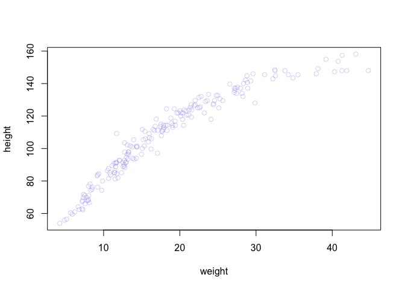
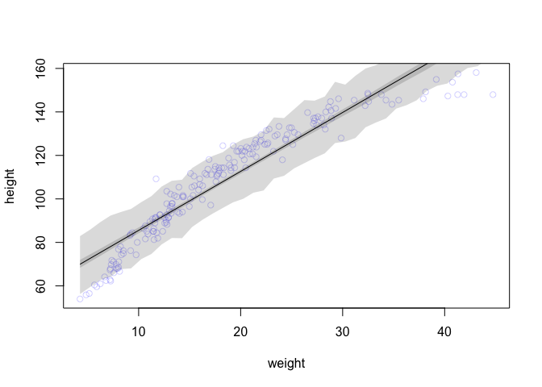

####4M4
#####A sample of students is measured for height each year for 3 years. After the third year, you want to fit a linear regression predicting height using year as a predictor. Write down the mathematical model definition for this regression, using any variable names and priors you choose. Be prepared to defend your choice of priors.

consider all combinations of mean & stdev -> posteriors; rank by plausibility; assumed kindergardeners? 

##hi ~ Normal(mu,theta)
##mui = alpha + betaxi
##alpha ~ (115,10)
##beta ~ (10,5)
##theta ~ (0,30) ??


####4M5
#####Now suppose I tell you that the average height in the first year was 120 cm and that every student got taller each year. Does this information lead you to change your choice of priors? How?

##hi ~ Normal(mu,theta)
##mui = alpha + betaxi
##alpha ~ (120,10)
##beta ~ (10,5)
##theta ~ (0,30) ??

####4M6
#####Now suppose I tell you that the variance among heights for students of the same age is never more than 64cm. How does this lead you to revise your priors?

##hi ~ Normal(mu,theta)
##mui = alpha + betaxi
##alpha ~ (120,10)
##beta ~ (10,5)
##theta ~ (0,8) 

####4H1
#####The weights listed below were recorded in the !Kung census, but heights were not recorded for these individuals. Provide predicted heights and 89% intervals (either HPDI or PI) for each of these individuals. That is, fill in the table below, using model-based predictions.


```r
library(rethinking)
```

```
## Loading required package: rstan
```

```
## Loading required package: ggplot2
```

```
## Loading required package: StanHeaders
```

```
## rstan (Version 2.18.2, GitRev: 2e1f913d3ca3)
```

```
## For execution on a local, multicore CPU with excess RAM we recommend calling
## options(mc.cores = parallel::detectCores()).
## To avoid recompilation of unchanged Stan programs, we recommend calling
## rstan_options(auto_write = TRUE)
```

```
## Loading required package: parallel
```

```
## rethinking (Version 1.88)
```

```r
data(Howell1)
d <- Howell1
formula <- alist(
  height ~ dnorm(mu, sigma),
  mu <- a + b * weight,
  a ~ dnorm(140, 30),
  b ~ dnorm(0, 10),
  sigma ~ dunif(0, 50)
)
(m <- map(formula, data = d))
```

```
## 
## Quadratic approximate posterior distribution
## 
## Formula:
## height ~ dnorm(mu, sigma)
## mu <- a + b * weight
## a ~ dnorm(140, 30)
## b ~ dnorm(0, 10)
## sigma ~ dunif(0, 50)
## 
## Posterior means:
##         a         b     sigma 
## 75.515335  1.762389  9.345932 
## 
## Log-likelihood: -1987.71
```

```r
new_weight <- c(46.95, 43.72, 64.78, 32.59, 54.63)
pred_height <- link(m, data = data.frame(weight = new_weight))
expected <- apply(pred_height, 2, mean)
interval <- apply(pred_height, 2, HPDI, prob = 0.89)
data.frame(
  individual = 1:5, 
  weight = new_weight, 
  expected = expected, 
  lower = interval[1, ], 
  upper = interval[2, ]
)
```

```
##   individual weight expected    lower    upper
## 1          1  46.95 158.2771 157.4958 159.1484
## 2          2  43.72 152.5793 151.8359 153.3183
## 3          3  64.78 189.7295 188.2108 191.1254
## 4          4  32.59 132.9459 132.2618 133.5664
## 5          5  54.63 171.8247 170.7793 172.9036
```

####4H2
#####Select out all the rows in the Howell1 data with ages below 18 years of age. If you do it right, you should end up with a new data frame with 192 rows in it.

```r
library(rethinking)
data(Howell1)
d <- Howell1
d2 <- Howell1[Howell1$age < 18, ]
nrow(d2)
```

```
## [1] 192
```
#####(a) Fit a linear regression to these data, using quap. Present and interpret the estimates. For every 10 units of increase in weight, how much taller does the model predict a child gets?


```r
xbar <- mean(d2$weight)
library(rethinking)
data(Howell1)
d <- Howell1
d2 <- Howell1[Howell1$age < 18, ]
nrow(d2)
```

```
## [1] 192
```

```r
m4.3 <- quap(
alist(
height ~ dnorm( mu , sigma ) ,
 mu <- a + b * weight,
a ~ dnorm( 110 , 30 ) ,
b ~ dlnorm( 0 , 10 ) ,
sigma ~ dunif( 0 , 60 )
) ,
data=d2 )
m <- map(formula, data = d2)
precis(m, corr = TRUE)
```

```
##            mean         sd      5.5%     94.5%
## a     58.409920 1.39584663 56.179088 60.640753
## b      2.712177 0.06823864  2.603118  2.821235
## sigma  8.437468 0.43060982  7.749270  9.125665
```
#####(b) Plot the raw data, with height on the vertical axis and weight on the horizontal axis. Superimpose the MAP regression line and 89% HPDI for the mean. Also superimpose the 89% HPDI for predicted heights.

```r
plot(height ~ weight, data = d2, col = col.alpha(rangi2, 0.3))
```

<!-- -->

```r
weight.seq <- seq(from = min(d2$weight), to = max(d2$weight), by = 1)
mu <- link(m, data = data.frame(weight = weight.seq))
```

```r
plot(height ~ weight, data = d2, col = col.alpha(rangi2, 0.3))

weight.seq <- seq(from = min(d2$weight), to = max(d2$weight), by = 1)
mu <- link(m, data = data.frame(weight = weight.seq))

mu.mean <- apply(mu, 2, mean)
mu.HPDI <- apply(mu, 2, HPDI, prob = 0.89)
lines(weight.seq, mu.mean)
shade(mu.HPDI, weight.seq)

sim.height <- sim(m, data = list(weight = weight.seq))
height.HPDI <- apply(sim.height, 2, HPDI, prob = 0.89)
shade(height.HPDI, weight.seq)
```

<!-- -->
#####(c) What aspects of the model fit concern you? Describe the kinds of assumptions you would change, if any, to improve the model. You don’t have to write any new code. Just explain what the model appears to be doing a bad job of, and what you hypothesize would be a better model.
